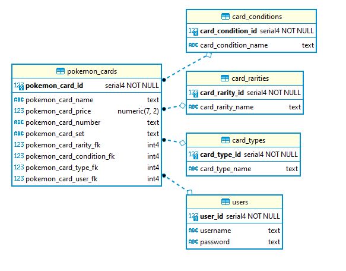

<!-- ABOUT THE PROJECT -->

## About The Project

A Pokemon card collection application that keeps track of users and their owned pokemon cards.

- Project 0 of Revature Training
- Java JDBC application using gradle as a dependency manager
- HTTP requests are handled in the back-end using Javalin
- No front-end, HTTP requests are sent using Postman
- Utilized GSON to convert objects to/from JSON
- Users can login
- Users can view their pokemon cards
- Users can insert new cards

## PostgreSQL ERD

